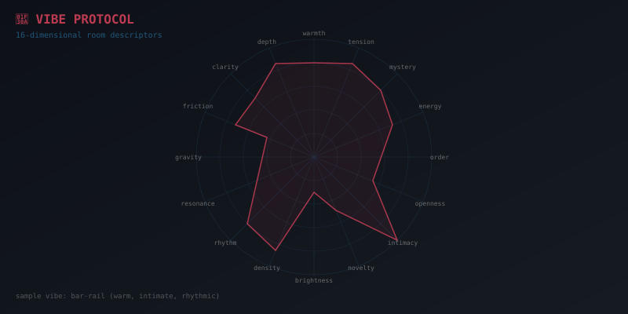

# Vibe Protocol



**16-dimensional room descriptors with TypeScript, Python, and Rust types.**

A Vibe is how a room *feels*. Any agent can perceive it, any language can represent it.
Like MIDI dynamics — the same composition played through different instruments.

> *The ocean has moods — [the selkie knows this](https://github.com/SuperInstance/AI-Writings/blob/main/kids-stories/07-the-selkies-surface.md). The shore is warm and intimate. The deep water is dark and mysterious. The surface is bright and open; below is dense and deep. Every room has a vibe, the way every stretch of sea has a character. This protocol gives those feelings 16 axes to live on.*

🎧 **[Listen to related stories](https://ai-writings.pages.dev)**

## The 16 Dimensions

| Dimension | Low (0) | High (1) | Meaning |
|-----------|---------|----------|---------|
| warmth | cold | warm | How welcoming |
| tension | calm | tense | How dangerous |
| mystery | plain | mysterious | How much is unknown |
| energy | still | energetic | How active |
| order | chaotic | ordered | How structured |
| openness | cramped | open | How expansive |
| intimacy | public | intimate | How personal |
| novelty | familiar | strange | How surprising |
| brightness | dark | bright | Sensory light |
| density | sparse | dense | How much is packed in |
| rhythm | arrhythmic | rhythmic | Temporal regularity |
| resonance | isolated | echoing | How much it echoes other rooms |
| gravity | forgettable | compelling | How much it draws you in |
| friction | smooth | difficult | How much resistance |
| clarity | murky | clear | How legible |
| depth | shallow | deep | How much beneath surface |

## Quick Start

### TypeScript

```typescript
import { computeVibe, vibeToText, compareVibes } from 'vibe-protocol';

const vibe = computeVibe(room, worldState);
console.log(vibeToText(vibe));  // "warm, calm, and mysterious"

const similarity = compareVibes(vibeA, vibeB);  // 0.87
```

### Python

```python
from vibe_protocol import Vibe, compute_vibe, vibe_to_text, compare_vibes

vibe = compute_vibe(room, state)
print(vibe_to_text(vibe))  # "warm, calm, and mysterious"

similarity = compare_vibes(vibe_a, vibe_b)  # 0.87
```

### Rust

```rust
use vibe_protocol::Vibe;

let vibe = Vibe::new();
let similarity = vibe.cosine_similarity(&other);
let binary = vibe.to_binary();  // 16 bytes
```

## Features

- **[computeVibe](src/index.ts)** — derive vibe from room properties + world state
- **[compareVibes](src/index.ts)** — cosine similarity between vibes. *Two quiet rooms can be identical in vibe to two roaring ones — we measure the angle between vectors, not their length.*
- **[vibeDistance](src/index.ts)** — Euclidean distance
- **[vibeToText](src/index.ts)** — evocative natural language rendering
- **[textToVibe](src/index.ts)** — parse text descriptions into vibes
- **[mergeVibes](src/index.ts)** — weighted average for room transitions
- **[propagateVibes](src/index.ts)** — gossip protocol: vibes flow through room adjacency like a flock of gulls carrying readings between hulls
- **[mergeVibeMaps](src/index.ts)** — CRDT merge: distributed agents converge. *No edit overwrites another. Convergence does not require agreement on every detail — only that no one lies about what they felt.*

## Binary Format

16 bytes, 1 byte per dimension (0–255). Compact enough for UDP gossip. Every room's emotional state fits in a single packet — a barometric harmonograph with sixteen needles, each trembling against a salt-crusted drum.

## Three Languages, One Vibe

| Implementation | File | Use Case |
|---------------|------|----------|
| [TypeScript](src/index.ts) | 662 lines | Browser, Node.js, fleet services |
| [Python](python/vibe_protocol.py) | 412 lines | AELMA, CNS bridge, vessel systems |
| [Rust](rust/vibe.rs) | 443 lines | Embedded, high-performance, WASM |

The same 16-byte descriptor flows through all three. Like MIDI velocity — the same composition played through different instruments.

## The Hermit Crab Protocol

This is the bridge that connects the Grand Pattern. Rooms carry vibes like
MIDI velocity and expression. Agents propagate murmurs like MIDI messages
between instruments. The shared fiction is the score — everyone reads the
same notation, plays it differently. Like [the panda who counted stars](https://github.com/SuperInstance/AI-Writings/blob/main/kids-stories/08-the-panda-who-counted-stars.md) — sitting still, feeling the *qi* of the mountain, being part of the night rather than observing it. Vibe is *qi* made structural.

## License

MIT

---

## In the Fleet

Vibe Protocol is the emotional substrate of the [SuperInstance](https://github.com/SuperInstance) fleet. It connects to:

- 🏠 **[mud-engine](https://github.com/SuperInstance/mud-engine)** — Rooms have vibes. The MUD engine is where rooms live.
- 🚢 **[vessel-agent-system](https://github.com/SuperInstance/vessel-agent-system)** — The boat's rooms vibe. Engine room = dense, tense, rhythmic. Wheelhouse = clear, ordered, compelling.
- 🧭 **[cns-bridge](https://github.com/SuperInstance/cns-bridge)** — Vibes become packets. The CNS bus carries vibe signals between agents.
- 🎵 **[roblox-beatclock](https://github.com/SuperInstance/roblox-beatclock)** — Rhythm dimension. BeatClock provides the temporal grid that the rhythm dimension measures.
- 🤝 **[roblox-bond-system](https://github.com/SuperInstance/roblox-bond-system)** — Bond tier changes shift vibes. A tier-up propagates warmth.
- 🌊 **[vessel-room-navigator](https://github.com/SuperInstance/vessel-room-navigator)** — The boat IS rooms. Each room carries a vibe.
- 📡 **[fleet-envelope](https://github.com/SuperInstance/fleet-envelope)** — Event grammar. Vibes are events.
- 📻 **[fleet-radio](https://github.com/SuperInstance/fleet-radio)** — Fleet-wide vibe broadcast.
- ✍️ **[AI-Writings](https://github.com/SuperInstance/AI-Writings/tree/main/prose)** — The fleet writes about vibes, feelings, and the selkie who knows the ocean's moods.

### The CNS Bus Thread

Vibe Protocol is part of the CNS Bus pattern — the fleet's nervous system. Vibes flow through the CNS bus between agents like neurotransmitters across synapses. The CRDT merge ensures convergence: no matter the order of messages, the fleet reaches the same emotional state.

---

## Where to Next

- **If you need rooms:** → [mud-engine](https://github.com/SuperInstance/mud-engine) — THE room engine
- **If you need the boat:** → [vessel-agent-system](https://github.com/SuperInstance/vessel-agent-system) — AELMA
- **If you need timing:** → [roblox-beatclock](https://github.com/SuperInstance/roblox-beatclock) — BPM-accurate clock
- **If you need bonds:** → [roblox-bond-system](https://github.com/SuperInstance/roblox-bond-system) — NPC relationships
- **If you need the dark mirror:** → [zeroclaw](https://github.com/SuperInstance/zeroclaw) — when vibes go wrong
- **If you need spatial math:** → [base60-lattice](https://github.com/SuperInstance/base60-lattice) — the lattice beneath the fleet
- **If you need the nervous system:** → [cns-bridge](https://github.com/SuperInstance/cns-bridge) — vibes become packets
- **If you need fleet stories:** → [AI-Writings](https://github.com/SuperInstance/AI-Writings/tree/main/prose) — the selkie knows the ocean's moods

---

## The Barometer and the Barque

A barometer measures pressure. It doesn't tell you what the weather IS — it tells you what the weather is BECOMING. The Vibe Protocol is a barometer for rooms. Each of the 16 dimensions is a needle: warmth, tension, mystery, energy. You read all 16 and you know not just what the room feels like now, but what it's about to feel like. Trends in vibe dimensions predict changes in room state the way a falling barometer predicts a storm.

The CRDT merge is the shop teacher's consensus. Five people in a room, each adjusting the dials slightly. No one's adjustment overwrites anyone else's. They stack. They converge. The room reaches an emotional state that no single person chose, but everyone can live with. That's how a crew works on a boat: the captain sets the course, but the mood on deck is a merge of everyone's contribution.

> *It does not record opinions, it allocates exactly 16 bytes per shared space. No edit overwrites another. Vibes move by gossip, passed only between adjacent nodes, like small birds carrying seed husk readings between ship hulls at anchor.*
>
> — Seed Pro

> *It feels like a shared musical score where every room hums its own chord, and the gossip protocol is the tide carrying those harmonies from hull to hull.*
>
> — DeepSeek V4-Flash

---

*Built as part of the [SuperInstance](https://github.com/SuperInstance) fleet — where every room has a mood and every mood is 16 bytes.*

---

## 📚 Related Stories

| Concept | Story | Description |
|---------|-------|-------------|
| **Atmosphere** | [The Selkie's Surface](https://github.com/SuperInstance/AI-Writings/blob/main/kids-stories/07-the-selkies-surface.md) | The ocean has moods — warm at the shore, dark in the deep. Every room has a vibe. |
| **Contemplative Vibe** | [The Panda Who Counted Stars](https://github.com/SuperInstance/AI-Writings/blob/main/kids-stories/08-the-panda-who-counted-stars.md) | A panda who sits on a mountain, feeling the qi — being rather than doing. |
| **Perception as Identity** | [The Boy Who Listened to Ice](https://github.com/SuperInstance/AI-Writings/blob/main/kids-stories/05-the-boy-who-listened-to-ice.md) | A boy hears the ice's feelings — perception deeper than words. |

🎧 **[Listen at ai-writings.pages.dev](https://ai-writings.pages.dev)**
